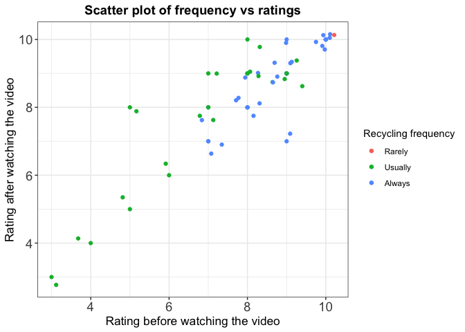
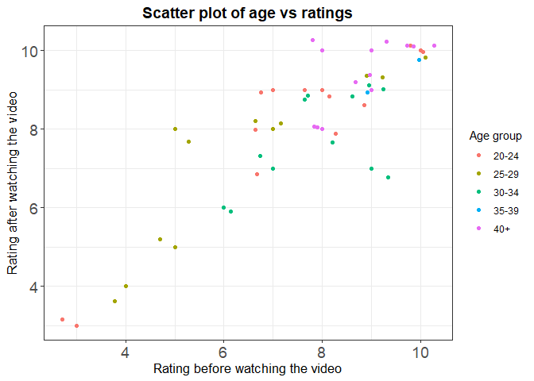

Milestone2\_EDA
================
Wilson D., Marcelle C. Kera Y. Heather VT.
4/5/2019

This dataset is aimed to answer the question "Does a person’s frequency of recycling influence her/his opinion and attitudes towards the importance of sustainability?". The description of columns as follows:

-   `Q1_1`: How important is being environmentally sustainable to you on a scale from 1-10?
-   `Q2`: How often do you generally recycle?
-   `Q3`: What is your age group?
-   `Q4`: Did you grow up in an environmentally-conscious family?
-   `Q5`: Will you watch the video?
-   `Q6_1`: After watching this video about recycling, how important is sustainability to you on a self-ranked scale from 1-10 scale?

Load Data
=========

``` r
#tidy data and give correct data type
tidy_data <- read_csv("../../Sustainable_Survey/data/Sustainable Survey_April 4, 2019_18.11.csv", col_types = cols(.default = col_character()))[3:62,18:23]
tidy_data <- tidy_data %>% 
  mutate(Q1_1 = as.numeric(Q1_1),
         Q2 = as.factor(Q2),
         Q3 = as.factor(Q3),
         Q4 = as.factor(Q4),
         Q5 = as.factor(Q5),
         Q6_1 = as.numeric(Q6_1))

# factor relevel
tidy_data$Q2 <- tidy_data$Q2 %>% fct_relevel("Rarely","Sometimes","Usually","Always")
tidy_data$Q4 <- tidy_data$Q4 %>% fct_relevel("Yes","No")
tidy_data$Q5 <- tidy_data$Q5 %>% fct_relevel("Have watched","Will pass")
```

``` r
# Creating summary table
summary(tidy_data)
```

    ##       Q1_1                Q2         Q3       Q4                Q5    
    ##  Min.   : 1.000   Rarely   : 2   20-24:19   Yes:28   Have watched:38  
    ##  1st Qu.: 7.000   Sometimes: 2   25-29:17   No :32   Will pass   :15  
    ##  Median : 8.000   Usually  :29   30-34:11            NA's        : 7  
    ##  Mean   : 7.767   Always   :27   35-39: 3                             
    ##  3rd Qu.: 9.000                  40+  :10                             
    ##  Max.   :10.000                                                       
    ##                                                                       
    ##       Q6_1       
    ##  Min.   : 1.000  
    ##  1st Qu.: 7.000  
    ##  Median : 9.000  
    ##  Mean   : 8.059  
    ##  3rd Qu.: 9.000  
    ##  Max.   :10.000  
    ##  NA's   :9

> Analyzing the summary table, we noticed:
>
> **Q1\_1: How important is being environmentally sustainable to you on a scale from 1-10?**: on average, people rated sustainability as a 7.7 initially. **Q2: How often do you generally recycle?**:
>
> **Q3: What is your age group?**: 60% of the participants are from the younger groups, having 20-29 years old. We had a considerable amount of people with 40+, but only 5% of the respondents are 35-39 years old.
>
> **Q4: Did you grow up in an environmentally-conscious family?**: 46.7% of the respondents grow up in an environmentally-conscious family.
>
> **Q5: Will you watch the video?**: Only 63% of the respondents confirmed that they watched the video.
>
> **Q6\_1: After watching this video about recycling, how important is sustainability to you on a self-ranked scale from 1-10 scale?**: The self rank about sustainability importance after watching the video had a slightly higher mean and median than the first one (9 and 8.1 vs. 8 and 7.8, respectively). However, some people who didn't watch the video answered the last question, since we had 15 respondents who said on Q5 that they passed the video, and only 9 participants answered NA to Q6\_1. Weird.

Explanatary Data Analysis
=========================

``` r
tidy_data %>% 
  ggplot() +
  geom_bar(aes(x = Q2, fill = Q4)) +
  facet_grid(~Q4) +
  theme_bw() +
  labs(x = "How often do you recycle? ",
       title = "Frequency of recycling vs. environmentally-conscious family") +
  scale_fill_discrete(name = "environmentally-conscious family?") +
  theme(axis.text.x = element_text(angle = 45, hjust = 1))
```


> As we can see from the above plot, most of our respondent have a good recycling habit whether or not they live in a environmentally-consicous family. However, if one respondent did not grow up in an environmentally-conscious family then he/she may not recycle at all.

``` r
tidy_data$Q3
```

    ##  [1] 20-24 30-34 20-24 30-34 20-24 25-29 30-34 20-24 25-29 20-24 20-24
    ## [12] 25-29 35-39 20-24 25-29 25-29 35-39 25-29 25-29 25-29 30-34 20-24
    ## [23] 30-34 30-34 40+   25-29 20-24 40+   25-29 20-24 25-29 25-29 25-29
    ## [34] 20-24 40+   25-29 30-34 25-29 20-24 30-34 35-39 25-29 20-24 20-24
    ## [45] 20-24 30-34 20-24 40+   40+   30-34 20-24 25-29 20-24 40+   30-34
    ## [56] 40+   40+   40+   20-24 40+  
    ## Levels: 20-24 25-29 30-34 35-39 40+

``` r
ggplot(tidy_data, aes(Q3)) +
  geom_histogram(stat="count") +
  labs(x = "Age groups",
       title = "Distribution of Ages of Survey Respondents")+
  theme_bw() 
```

    ## Warning: Ignoring unknown parameters: binwidth, bins, pad


``` r
qplot(tidy_data$Q3, tidy_data$Q1_1, geom="boxplot") +
  ylim(0, 10) +
  theme_bw() +
  labs(x = "Age Group",
       y = "Sustainability Importance") +
  ggtitle("Sustainability Importance vs. Age Group") +
  theme(plot.title = element_text(size = 14, face = "bold", hjust = 0.5)) +
  theme(axis.text = element_text(size = 14),
       axis.title = element_text(size = 13))
```


> Analyzing the boxplots above is easy to see that older people (`35-39` and `40+` groups) consider sustainability more important than younger groups, having a higher mean (~9 in a scale from 1-10) and narrower range. Additionaly, the other 3 groups (`20-24`, `25-29` and `30-34`) have one outlier each, where at least one respondent of each of these groups evaluated sustainability with a considerable lower importance in comparison with the other participants from their respective group. However, it's important to take into account that we have fewer responses from the second oldest age group, which can distort the analysis. Further analysis with confidence intervals is warranted.

``` r
tidy_data %>% filter(Q5 %in% 'Have watched') %>% 
  ggplot(aes(x = Q1_1, y = Q6_1, color = Q2)) +
  geom_point() +
  geom_jitter() +
  #facet_grid(.~Q3) +
  labs(x = "Rating before watching the video",
       y = "Rating after watching the video",
       colour ="Recycling frequency") +
  theme_bw()
```



``` r
tidy_data %>% filter(Q5 %in% 'Have watched') %>% 
  ggplot(aes(x = Q1_1, y = Q6_1, color = Q3)) +
  geom_point() +
  geom_jitter() +
  #facet_grid(.~Q3) +
  labs(x = "Rating before watching the video",
       y = "Rating after watching the video",
       colour ="Age group") +
  theme_bw()
```



> The respondents changed their opinion on how sustainable they think they are in the positive direction. There were only two respondents who scored less after watching the video .Respondents scored more after the watching the video are the ones recycle usually. Respondents score does not appear to be affected by age group, there may be other underlying confounding factors in which we did not capture in our data collection.

``` r
#ggplot(mtcars, aes(factor(cyl), fill = factor(vs))) +
 # geom_bar(position = "dodge2")

library(forcats)
#as.factor(tidy_data$Q1_1)
#as.factor(tidy_data$Q6_1)
tidy_data %>% 
  filter(Q5 %in% 'Have watched') %>% 
  #Q1_1= as.factor(Q1_1)
  #Q6_1= as.factor(Q6_1)
  #before_vs_after = factor(Q1_1) %>%
  ggplot(aes(Q1_1, fill = Q6_1)) +
  geom_bar(position= "dodge2") +
  labs(x = "Rating before and after watching the video") +
  theme_bw()
```


