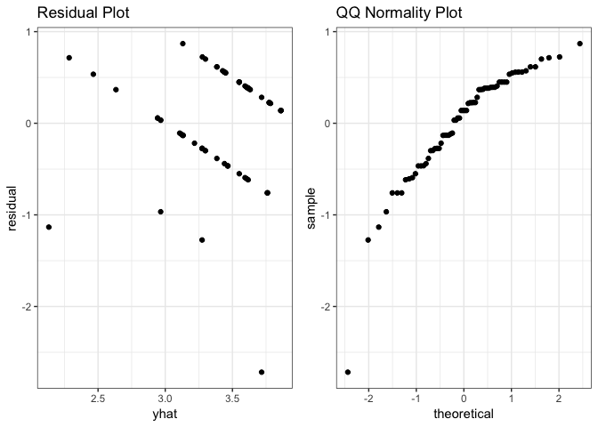

Milestone 3
================
Heather VT., Kera Y., Marcelle C., Wilson D.
April 13th, 2019

Introduction
------------

The current analysis seeks to explore the relationship between `self-rated sustainability importance` and `recycling frequency`. Additionally, the analysis also aims to determine whether this relationship is confounded by an `age of the individual` and `background (environmentally-conscious family)`, and analyze if a video about recycling changes individuals�� opinions on the importance of sustainability. With this purpose, we published a [survey](https://ubc.ca1.qualtrics.com/jfe/form/SV_4SJCJH59wUakrEF) using [UBC-hosted version of Qualtrics](https://ubc.ca1.qualtrics.com/) to collect responses to be used in this analysis.

Methods
-------

### Survey study design

### Data collection methods

> Online survey with Qualtrics UBC

Data was collected from participents who agreed to give consent to share their data in which was used to address our survey objective. Participants rated themselves in terms of how sustainable they think they are (main predictor). We also collected data on frequency of recycling habits, age of the participants and whether or not the participant was brought up in environmentally consious family. Our assumption is that the main response is frequency of recycling, and age and background is confounding factors.

Additionally we gave an option for the participant to watch a short video and asked them to rate themselves based on change in self perseption towards sustainability.

### Analysis methods

Ordinal linear regression is performed to analyze relationship between `self-rated sustainability importance` and `recycling frequency`, as well as `age of the individual` and `background (environmentally-conscious family)`.

Assumptions of the Ordinal Linear regression are; (1) one predictor in the model (`recycling frequency`), (2) Each category has its own regression model, (3) No category has 0 count. After fitting the additive model, we also explored multiplicative model to reveal the effects of confounding variables.

Results
-------

``` r
# load data
tidy_data <- read.csv("../data/tidy_data.csv")

# factor relevel
tidy_data$recycling_freq <- tidy_data$recycling_freq %>% fct_relevel("Rarely","Sometimes","Usually","Always")
tidy_data$background <- tidy_data$background %>% fct_relevel("Yes","No")
tidy_data$watch <- tidy_data$watch %>% fct_relevel("Have watched","Will pass")
```

``` r
# Creating summary table
#summary(tidy_data)
```

``` r
# Changing recycling_freq to not be a factor for linear regression analysis.
tidy_data <- tidy_data %>%
  mutate(recycling_freq_nf = if_else(recycling_freq =="Always",
                                     5, if_else(recycling_freq == "Usually",
                                     4, if_else(recycling_freq == "Sometimes",
                                     3, if_else(recycling_freq == "Rarely",
                                     2, if_else(recycling_freq == "Never",
                                     1, 0))))))
```

``` r
simple_model= lm(data=tidy_data, recycling_freq_nf ~ self_rating_before)
age_confounder= lm(data=tidy_data, recycling_freq_nf ~ self_rating_before + age)
background_confounder= lm(data=tidy_data, recycling_freq_nf ~ self_rating_before + background)
interaction_effects = lm(data=tidy_data, recycling_freq_nf ~ self_rating_before + background*age)

summary(simple_model)
```

    ##
    ## Call:
    ## lm(formula = recycling_freq_nf ~ self_rating_before, data = tidy_data)
    ##
    ## Residuals:
    ##     Min      1Q  Median      3Q     Max
    ## -2.7704 -0.4128  0.2296  0.4084  0.8385
    ##
    ## Coefficients:
    ##                    Estimate Std. Error t value Pr(>|t|)    
    ## (Intercept)         2.98277    0.30500   9.779 1.83e-14 ***
    ## self_rating_before  0.17876    0.03743   4.776 1.03e-05 ***
    ## ---
    ## Signif. codes:  0 '***' 0.001 '**' 0.01 '*' 0.05 '.' 0.1 ' ' 1
    ##
    ## Residual standard error: 0.6029 on 66 degrees of freedom
    ## Multiple R-squared:  0.2569, Adjusted R-squared:  0.2456
    ## F-statistic: 22.81 on 1 and 66 DF,  p-value: 1.033e-05

> The simple model with just X and Y has a significant F-statistic, meaning we can reject the null hypothesis that there is no effect of X on Y.

> In order to understand if there are confounding variable though, we need to take a closer look and compare the simple linear model with the linear models that include confounding variables.

``` r
anova(simple_model, age_confounder)
```

    ## Analysis of Variance Table
    ##
    ## Model 1: recycling_freq_nf ~ self_rating_before
    ## Model 2: recycling_freq_nf ~ self_rating_before + age
    ##   Res.Df    RSS Df Sum of Sq      F Pr(>F)
    ## 1     66 23.988                           
    ## 2     62 23.122  4   0.86641 0.5808 0.6776

> Age does not seem to be a significant factor in predicting recycling frequency. p-value&gt;0.05

``` r
#summary(background_confounder)
anova(simple_model, background_confounder)
```

    ## Analysis of Variance Table
    ##
    ## Model 1: recycling_freq_nf ~ self_rating_before
    ## Model 2: recycling_freq_nf ~ self_rating_before + background
    ##   Res.Df    RSS Df Sum of Sq      F Pr(>F)
    ## 1     66 23.988                           
    ## 2     65 23.740  1   0.24781 0.6785 0.4131

> Background does not seem to be a significant factor in predicting recycling frequency.

``` r
summary(interaction_effects)
```

    ##
    ## Call:
    ## lm(formula = recycling_freq_nf ~ self_rating_before + background *
    ##     age, data = tidy_data)
    ##
    ## Residuals:
    ##     Min      1Q  Median      3Q     Max
    ## -2.6688 -0.2381  0.0000  0.4487  0.8766
    ##
    ## Coefficients:
    ##                       Estimate Std. Error t value Pr(>|t|)    
    ## (Intercept)            3.04157    0.38662   7.867 1.14e-10 ***
    ## self_rating_before     0.16838    0.04224   3.986 0.000193 ***
    ## backgroundNo          -0.01232    0.27866  -0.044 0.964892    
    ## age25-29               0.29954    0.27690   1.082 0.283919    
    ## age30-34               0.11140    0.34913   0.319 0.750840    
    ## age35-39              -0.55698    0.46310  -1.203 0.234056    
    ## age40+                 0.27464    0.35755   0.768 0.445587    
    ## backgroundNo:age25-29 -0.55243    0.39379  -1.403 0.166085    
    ## backgroundNo:age30-34  0.20402    0.46885   0.435 0.665102    
    ## backgroundNo:age35-39  0.84394    0.79435   1.062 0.292523    
    ## backgroundNo:age40+   -0.31883    0.44832  -0.711 0.479872    
    ## ---
    ## Signif. codes:  0 '***' 0.001 '**' 0.01 '*' 0.05 '.' 0.1 ' ' 1
    ##
    ## Residual standard error: 0.6046 on 57 degrees of freedom
    ## Multiple R-squared:  0.3545, Adjusted R-squared:  0.2413
    ## F-statistic: 3.131 on 10 and 57 DF,  p-value: 0.002997

> There are no interaction effects, so we can just look at the single variables as potential confounders... (better explanation needed)

``` r
all_variables= lm(data=tidy_data, recycling_freq_nf ~ self_rating_before + background + age)

summary(all_variables)
```

    ##
    ## Call:
    ## lm(formula = recycling_freq_nf ~ self_rating_before + background +
    ##     age, data = tidy_data)
    ##
    ## Residuals:
    ##     Min      1Q  Median      3Q     Max
    ## -2.7215 -0.2918  0.1179  0.4111  0.8872
    ##
    ## Coefficients:
    ##                    Estimate Std. Error t value Pr(>|t|)    
    ## (Intercept)         3.04086    0.37623   8.083 3.17e-11 ***
    ## self_rating_before  0.17607    0.04237   4.156 0.000103 ***
    ## backgroundNo       -0.16052    0.15897  -1.010 0.316589    
    ## age25-29            0.01157    0.19888   0.058 0.953785    
    ## age30-34            0.27821    0.23211   1.199 0.235306    
    ## age35-39           -0.29734    0.38331  -0.776 0.440912    
    ## age40+              0.08049    0.22470   0.358 0.721438    
    ## ---
    ## Signif. codes:  0 '***' 0.001 '**' 0.01 '*' 0.05 '.' 0.1 ' ' 1
    ##
    ## Residual standard error: 0.6106 on 61 degrees of freedom
    ## Multiple R-squared:  0.2955, Adjusted R-squared:  0.2262
    ## F-statistic: 4.264 on 6 and 61 DF,  p-value: 0.001192

> Including all predictive variables in the model shows that on average, for each unit increase in X, there is a 0.176 increase in y. This means that for every increase in self-importance of sustainability rating there is a 0.17 increase in frequency of recycling. The p-value is 0.000103, which is significant with an alpha of 0.05. Therefore, we can reject the null hypothesis and say that there is a positive relationship between self-rated importance of being sustianable and one's frequency of recycling.

#### Important assumptions:

-   1.  There are only two possible confounding variables: age, background. In the literature it appears that income is a significant predictor of recycling frequency, which we did not include in our survey. (Schultz et al. 1995)

-   1.  The strength of the (X,Y) association within each strata defined by the confounders is the same.

-   1.  There is a simple linear relationshing in how Y varies accross the strata.

``` r
lm_test <- lm(recycling_freq %>% as.numeric() ~ self_rating_before + background + age, data = tidy_data)

lm_data <- tidy_data %>%
  mutate(recycling_freq_num = as.numeric(recycling_freq),
         lm_fitted = lm_test %>% fitted(),
         lm_resid = lm_test %>% resid())

resid_plot <- lm_data %>%
  ggplot(aes(x= lm_fitted, y = lm_resid)) +
  geom_point() +
  labs(x="yhat", y="residual",title="Residual Plot") +
  theme(plot.title = element_text(size = 14, face = "bold", hjust = 0.5),
        axis.text = element_text(size = 12),
        axis.title = element_text(size = 13))

qq_norm <- lm_data %>%
  ggplot(aes(sample= lm_resid)) +
  stat_qq() +
  labs(title="QQ Normality Plot") +
  theme(plot.title = element_text(size = 14, face = "bold", hjust = 0.5),
        axis.text = element_text(size = 12),
        axis.title = element_text(size = 13))

grid.arrange(resid_plot,qq_norm,nrow=1)
```



We compiled the self-rated sustainability importance, recycling frequency, age and background information from 68 survey entries. Thus, to have a general idea of the relationship between self-rated sustainability importance and recycling frequency, we can analyze the following boxplots.

``` r
# Visualization of relationship between recycling freq. and self rating before watching the video
tidy_data %>%
  ggplot(aes(x = recycling_freq, y = self_rating_before)) +
  geom_boxplot(size = .75) +
  geom_jitter(alpha = .1, height = .2) +
  theme(axis.text.x = element_text(angle = 45, hjust = 1, vjust = 1)) +
  coord_flip() +
  theme_bw() +
  labs(y = "Rating before watching the video", x = "Recycling Frequency") +
  ggtitle("Sustainability Importance vs. Recycling Freq.") +
  theme(plot.title = element_text(size = 14, face = "bold", hjust = 0.5),
        axis.text = element_text(size = 12),
        axis.title = element_text(size = 13))
```


Analyzing the boxplots above is easy to notice that people who recycle more often consider sustainability more important (having a higher self rating mean, and narrower range) than the ones who rarely recycle, which suggests that a person's opinion about sustainability importance influences the recycling frequency.

Thus, fitting an ordinal regression model considering self-rated sustainability importance before watching the video, individuals' age and background as predictors:

``` r
# Fit a OLR model without interaction
olr_model <- polr(recycling_freq ~ self_rating_before + background + age, data = tidy_data)

tidy_data <- tidy_data %>%
  cbind(., olr_model_prob = predict(olr_model, ., type = "probs")) %>% #estimated probability
  cbind(., olr_model_decision = predict(olr_model))                   #estimated result according to the probabilities
```

Analyzing the goodness of fit, looking for AIC and likelihood, we obtained:

``` r
gf <- table(tidy_data$recycling_freq, tidy_data$olr_model_decision)
accuracy <- (gf[1] + gf[6] + gf[11] + gf[16]) / 68 # 68 observations

print(paste("AIC = ", AIC(olr_model)))
```

    ## [1] "AIC =  115.158392854266"

``` r
print(paste("Log likelihood = ", logLik(olr_model)))
```

    ## [1] "Log likelihood =  -48.5791964271329"

``` r
print(paste("Overall accuracy = ", accuracy)) # The larger the better
```

    ## [1] "Overall accuracy =  0.75"

The values look nice, so now we can get the coefficients:

``` r
# Get the coefficients
coef(summary(olr_model))
```

    ##
    ## Re-fitting to get Hessian

    ##                         Value Std. Error    t value
    ## self_rating_before  0.6730300  0.1722552  3.9071686
    ## backgroundNo       -0.6121531  0.5838547 -1.0484681
    ## age25-29            0.1367529  0.6936227  0.1971575
    ## age30-34            1.0566521  0.8263358  1.2787200
    ## age35-39           -1.1883473  1.2716763 -0.9344732
    ## age40+              0.9466290  0.8470890  1.1175083
    ## Rarely|Sometimes    0.5565850  1.3782016  0.4038488
    ## Sometimes|Usually   1.4665515  1.2980113  1.1298449
    ## Usually|Always      5.4871804  1.5288542  3.5890802

Interpreting the coefficients:

-   Example of slope interpretation: For `self_rating_before`, one unit increase in `self_rating_before`, there is a ~0.67 increase in the expected value of recycling frequency (in log odds scale), given that all of the other variables in the model are constant. A positive slope indicates a tendency for the response level to increase as the predictor increases.

-   Example of intercept interpretation: ~5.49 is the expected log odds of recycle "usually" versus "always" when all the predictors are 0.

Multiplicative effect of the confounders are explored below:

``` r
# Fit a OLR model with interaction
olr_model_interaction <- polr(recycling_freq ~ self_rating_before + background * age, data = tidy_data)

tidy_data <- tidy_data %>%
  cbind(., olr_model_prob2 = predict(olr_model_interaction, .,
                                    type = "probs")) %>% #estimated probability
  cbind(., olr_model_decision2 = predict(olr_model_interaction))                   #estimated result according to the probabilities
```

``` r
gf2 <- table(tidy_data$recycling_freq, tidy_data$olr_model_decision2)
accuracy <- (gf2[1] + gf2[6] + gf2[11] + gf2[16]) / 68 # 68 observations

print(paste("AIC for OLR model with interaction = ", AIC(olr_model_interaction)))
```

    ## [1] "AIC for OLR model with interaction =  115.320868480606"

``` r
print(paste("Log likelihood of OLR model with interaction = ", logLik(olr_model_interaction)))
```

    ## [1] "Log likelihood of OLR model with interaction =  -44.660434240303"

``` r
print(paste("Overall accuracy of OLR model with interaction = ", accuracy)) # The larger the better
```

    ## [1] "Overall accuracy of OLR model with interaction =  0.764705882352941"

We did not observe improvement in the model when interaction between background and age was added to the model.

``` r
summary(olr_model_interaction)
```

    ##
    ## Re-fitting to get Hessian

    ## Call:
    ## polr(formula = recycling_freq ~ self_rating_before + background *
    ##     age, data = tidy_data)
    ##
    ## Coefficients:
    ##                          Value Std. Error    t value
    ## self_rating_before      0.6900  1.798e-01  3.837e+00
    ## backgroundNo           -0.1823  9.800e-01 -1.860e-01
    ## age25-29                1.3266  1.067e+00  1.243e+00
    ## age30-34                0.3358  1.196e+00  2.807e-01
    ## age35-39               -2.5077  1.792e+00 -1.400e+00
    ## age40+                 27.0208  5.071e-01  5.329e+01
    ## backgroundNo:age25-29  -2.1224  1.471e+00 -1.443e+00
    ## backgroundNo:age30-34   1.0666  1.658e+00  6.432e-01
    ## backgroundNo:age35-39  14.1716  2.707e-05  5.235e+05
    ## backgroundNo:age40+   -26.4871  5.071e-01 -5.223e+01
    ##
    ## Intercepts:
    ##                   Value       Std. Error  t value    
    ## Rarely|Sometimes       0.5967      1.4872      0.4012
    ## Sometimes|Usually      1.5747      1.4054      1.1205
    ## Usually|Always         5.8336      1.6405      3.5560
    ##
    ## Residual Deviance: 89.32087
    ## AIC: 115.3209

``` r
# Get the coefficients
exp(coef((olr_model_interaction)))
```

    ##    self_rating_before          backgroundNo              age25-29
    ##          1.993751e+00          8.333499e-01          3.768372e+00
    ##              age30-34              age35-39                age40+
    ##          1.398993e+00          8.145248e-02          5.432111e+11
    ## backgroundNo:age25-29 backgroundNo:age30-34 backgroundNo:age35-39
    ##          1.197465e-01          2.905514e+00          1.427799e+06
    ##   backgroundNo:age40+
    ##          3.139044e-12

Interpretation of the multiplicative model:

5.8 is the expected log odds of recycling frequency of usually versus always when all the predictors are 0.

If a person rates themselves one unit more, the odds of increase in recycling from a lower frequency to a higher frequency is multiplied by 1.994.

Discussion
----------

### Discussion of results

### Discussion of survey/study design

### References

1.  Schultz, P. W., Oskamp, S., & Mainieri, T. (1995). Who recycles and when? A review of personal and situational factors. Journal of Environmental Psychology, 15(2), 105-121. <http://dx.doi.org/10.1016/0272-4944(95)90019-5>.

### NOTES for reference

> 3-5 page report

    > Your target audience is other Data Scientists who are not familiar with your project.
    Clearly introduce the survey topic and question you were interested in answering.
    Link to your study's data and code in the methods section of your report.
    Include effective visualizations and/or tables that help communicate your findings.
    Your discussion should have 2 key focuses:
        Discussing the results and findings of your survey and analysis of the survey data.
        Discussing your survey/study design, specifically:
        what did you do well to make this study as causal as possible?
        what was not done well and how did that effect your studies conclusions?
        what would you do differently next time to improve your survey/study design and why?
